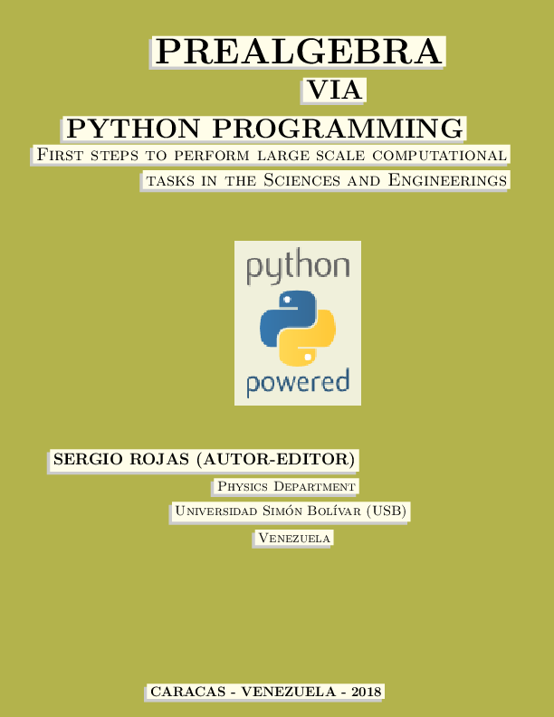

 <h2><a href="https://www.researchgate.net/publication/325473565" target="_blank">Prealgebra via Python Programming</a></h2>

 <table style="width:100%">
  <tr>
     <td>
         
     </td>
     <td>

[This book](https://www.researchgate.net/publication/325473565)
was written for students and instructors who want to learn how 
to use a computer for other than the most common uses, such as web 
browsing, document creation, or paying bills online. This book is for 
anyone who wants to perform computational tasks that they design. In 
other words, if you wish to learn how to program a computer, this book 
is for you.

Because prealgebra is a subject that practically everyone is supposed to 
learn in grade school, it provides a platform to introduce basic 
computer programming concepts. Consequently, this book should also be of 
interest to students in middle or high school who want to learn how to 
program, and who are willing to invest the time and effort in learning a 
programming language that they could continue using throughout their 
schooling and in their professional life. Similarly, this book could 
also be of interest to pre-service and in-service mathematics teachers 
wishing to have at their disposal a complementary tool to assist in 
fostering understanding, competency, and interest in mathematics among 
their students. This book can be integrated with the teachers’ 
curriculum as a way to tackle non-traditional math problems using an 
inexpensive (non-commercial) modern computer language, as is 
[Python](https://www.python.org/).

By the end of the book, a reader will have learned enough to be able to 
write a preliminary, step-by-step one variable equation solver that can 
be expanded to be used to find solutions to more complex equations. In 
other words, by the end of the book, you will be able to write code that 
programs your machines to solve equations. This code is foundational and 
readers are encouraged to learn on their own how to build on it to suit 
their mathematics learning needs.

As we would like this reference material to be improved over time,
we encourage you to contribute changes or corrections, which will be
reviewed, edited, and properly acknowledged by the maintainer of this site.
        </td>
  </tr>
</table>
 

 
**We are on Twitter**: <a href="https://www.researchgate.net/publication/325473565" target="_blank">Twitter</a>
 

